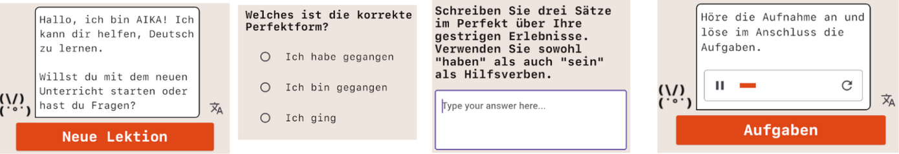
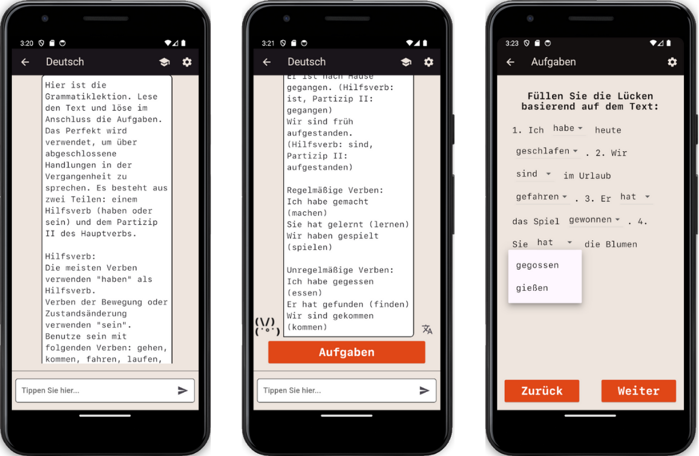
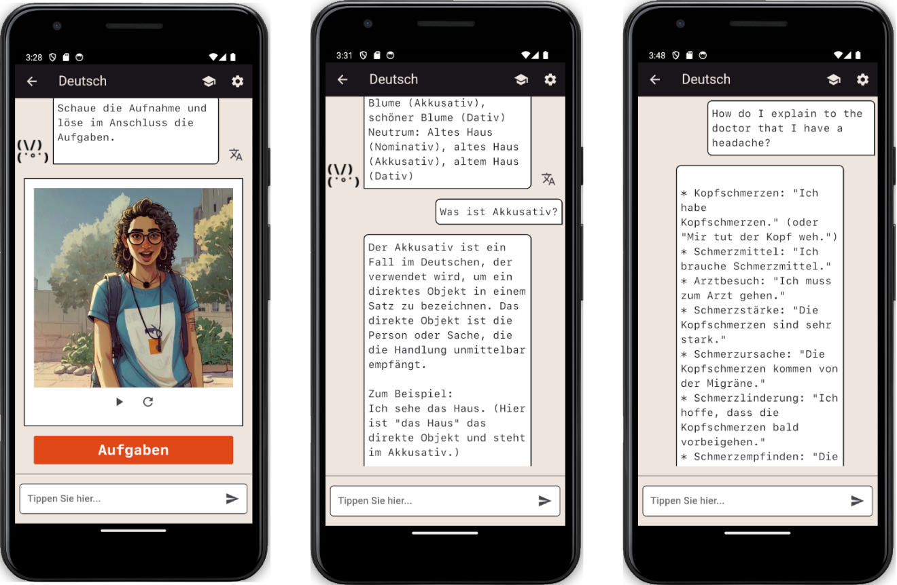
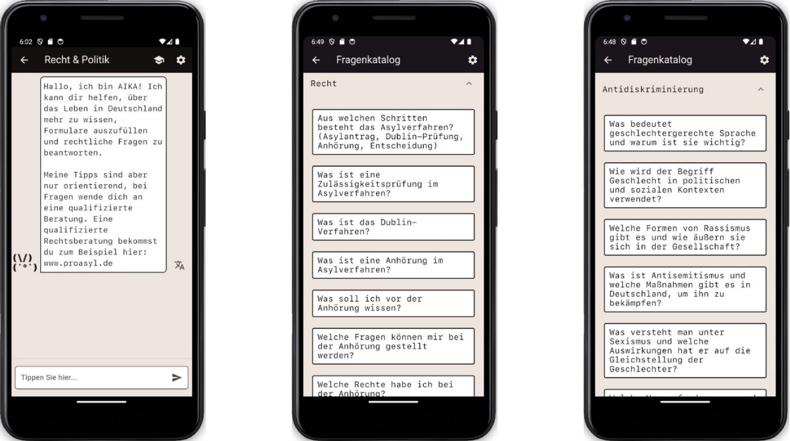
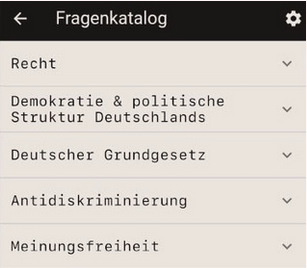
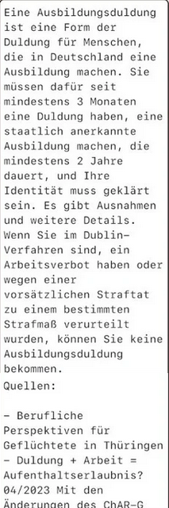
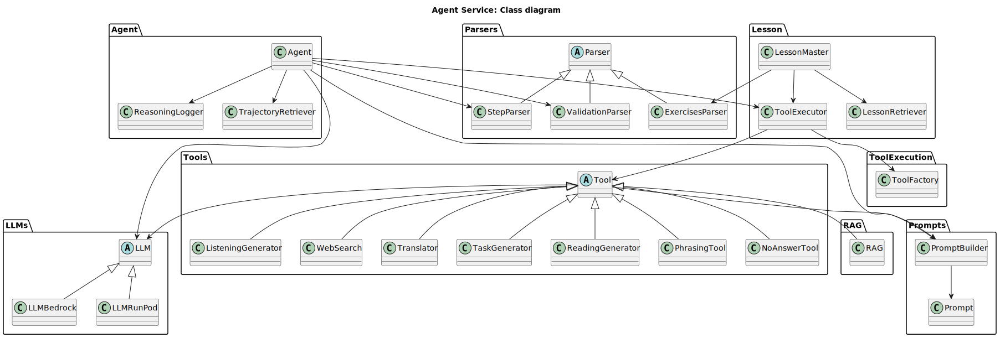

# README

 

AIKA is an AI-based app that can be used to replace or support the earlier stages of the integration course for migrants. 

## Motivation

The average waiting time for an integration course in 2023 was more than 5 months (according to the Federal Audit Office). This is a period of time in which refugees and other groups of migrants have to wait for an offer of a place on a course. There is also a lack of staff and inaccessible offers in the area of law & political education, which in turn makes life in Germany more difficult for many people and makes the work of social workers inefficient.

## Description of the System

## German
Our German learning module focuses on developing users' writing, reading and listening skills through a series of interactive and adaptive lessons. The intelligent tutoring system we have developed not only provides traditional learning content such as grammar explanations, reading and listening texts, but also creates exercises for each lesson. These exercises include single-choice, gap-filling and open-ended questions, all generated by the language model. 
The intelligent system understands German, English, Russian, Ukrainian, Arabic and Turkish. Users can also choose to have all system messages translated into their preferred language.

*Image 1: Introductory message, Image 2: Single-choice question, Image 3: Open-ended question, Image 4: Widget of a listening*

*Image 1: Grammar explanation, Image 2: Grammar explanation, Image 3: Gap-filling exercise*

In addition, the tutoring system enables a dialogue-based learning approach. Users can ask questions in real time about grammatical details, the meaning of expressions, or for more examples. The system also offers situational phrase help to help users apply and deepen their language skills in different everyday situations.

*Image 1: Widget of a listening exercise, Image 2: Example of a question on the grammar, Image 3: Example of phrase help*

This interactive and user-centred approach ensures that each learner is supported individually and can progress effectively according to the A2 syllabus.

## Law and Politics

Our law and politics curriculum is designed as an interactive question catalogue. Users can choose from a list of questions covering both legal and political topics. After selecting a question, detailed information on the topic is displayed. There is also the option to enter into a dialogue with our chatbot and explore the topic in more depth.

*Image 1: Introductory message, Image 2: Legal questions, Image 3: Anti-discrimination questions*

\
*Image: Question catalogue categories*

The chatbot only answers using information from a knowledge base that we have manually compiled based on official guidelines and guidance. This is to ensure accurate and reliable answers that help learners develop a sound understanding of Germany's legal foundations and political structures.

\
*Image: Example of a chatbot response*'

# Agent Microservice Architecture

The architecture of the Agent Microservice is illustrated in the following diagram:

*Image: Class-Diagram - Agent Microservice*

## Technic Requirements
### Technology Stack:
- OS: Android, IOS;
- UI Stack: Flutter
- Backend Stack: Typescript(NestJS), Python (Flask)
- Data Storage: MilvusDB, PostgreSQL

### Tools, API & Software:
- Version Control: Git
- Containerization: Docker, Kubernetes
- API Dependencies: Deepl, OpenSearch
- LLM Hosting: AWS Bedrock

## Code-Conventions & Documentation
- PEP 8 Standard for Python-Code. 
- Use of Linters (e.g. pylint). 
- DocStrings style: NumPy
- Swagger API for API documentation
- PlantUML for creating UML diagrams

For the further implementation details and installation guide, see [Documentation](docs/docs.md).

