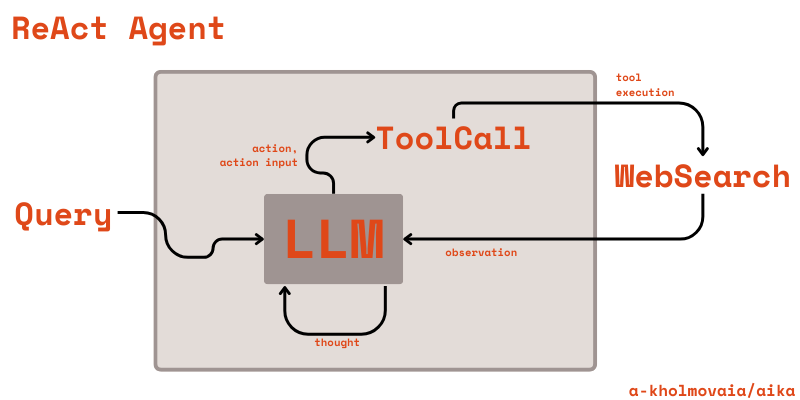

# German Chat ReAct Agent

ReAct Agent is a thought-action-observation loop that enables a LLM to use external tools such as web-searching, retrieving information from data bases, browsing, and to reason over a context provided from those tools ("observations") in order to solve diverse decision-making and language tasks.



## Introduction

Solving complex interactive tasks requires the ability to reason in multiple steps preserving the intermediate conclusions. 

Complex reasoning, reasoning in interactive enviroments. 

Few shot prompting -> Chain-Of-Thoughts

CoT vs React

## ReAct Agent : Definition

The classical reinforcement learning setting implies that given an action space $\mathcal{A}$, an observation space $\mathcal{O}$ and a time step $t$, the agent recieves an einviroment observation $o_t \in \mathcal{O}$ and use a policy $π(a_t|c_t)$ to generate an action $a_t \in \mathcal{A}$, where the $c_t$ - the context - is a sequence of actions and observations. 

In the ReAct setting the action space is extended with unlimited language space $\mathcal{L}$. The elements of $\mathcal{L}$ are refered to as thoughts, or reasoning traces. A thought $\hat{a_t}$ is a reasoning step over a context $c_t$. (Yao et al., 2023)[[1]](#1). Instead of cost and resource intensive training, the ReAct agent doesn't require any training. However, due to the unlimited nature of the language space $\mathcal{L}$, a large enough language model should be used to ensure the desired internal knowledge and ability to carry out reasoning steps. 

The ReAct loop can be described as follows (Liu et al, 2024)[[2]](#2):
```
Input: User query Q
Output: Response response
M := llm
T := tools
P := prompt
S := intermediate steps

while True:
  action := M(P,S,Q)
  if action, action_input = "Final Answer":
    break
  observation := tools[action](action_input)
  thought := M(P,S,Q, observation)
end
response := action_input
```
The agent produces thoughts based on the prompt and user query, selects a tool from the tool list, defines the the input for the tool. Then the tool is being executed, providing an "observation", the result of the tool use. Based, on the observation the agent generates a thought summurizing the observations and reasons towards the next suitable action. 


## German Chat ReAct Agent 


## References
<a id="1">[1]</a> 
S. Yao et al., “ReAct: Synergizing Reasoning and Acting in Language Models.” arXiv, Mar. 09, 2023. Accessed: May 14, 2024. [Online]. Available: http://arxiv.org/abs/2210.03629

<a id="2">[2]</a> 
Y. Liu et al., “From Summary to Action: Enhancing Large Language Models for Complex Tasks with Open World APIs.” arXiv, Feb. 28, 2024. Accessed: May 14, 2024. [Online]. Available: http://arxiv.org/abs/2402.18157

