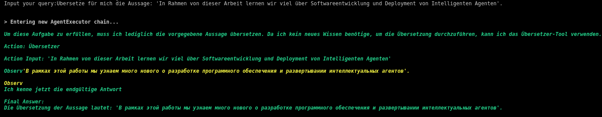

# German Chat ReAct Agent

ReAct Agent is a thought-action-observation loop that enables an LLM to use external tools such as web searches, database retrieval, and browsing, and to reason about a context provided by these tools ("observations") to solve various decision-making and language tasks.

[](res/react_agent.png)

## ReAct Agent : Definition

The classical reinforcement learning setting implies that given an action space $\mathcal{A}$, an observation space $\mathcal{O}$ and a time step $t$, the agent recieves an einviroment observation $o_t \in \mathcal{O}$ and use a policy $π(a_t|c_t)$ to generate an action $a_t \in \mathcal{A}$, where the $c_t$ - the context - is a sequence of actions and observations. 

In the ReAct setting the action space is extended with unlimited language space $\mathcal{L}$. The elements of $\mathcal{L}$ are refered to as thoughts, or reasoning traces. A thought $\hat{a_t}$ is a reasoning step over a context $c_t$. (Yao et al., 2023)[[1]](#1). Instead of cost and resource intensive training, the ReAct agent doesn't require any training. However, due to the unlimited nature of the language space $\mathcal{L}$, a large enough language model should be used to ensure the desired internal knowledge and ability to carry out reasoning steps. 

The ReAct loop can be described as follows (Liu et al, 2024)[[2]](#2):
```
Input: User query Q
Output: Response response
M := llm
T := tools
P := prompt
S := intermediate steps

while True:
  action := M(P,S,Q)
  if action, action_input = "Final Answer":
    break
  observation := tools[action](action_input)
  thought := M(P,S,Q, observation)
end
response := action_input
```
The agent produces thoughts based on the prompt and user query, selects a tool from the tool list, defines the the input for the tool. Then the tool is being executed, providing an "observation" - the result of the tool use. Based on the observation, the agent generates a thought summarizing the observations and reasons towards the next suitable action. 

Below is a small example from our demo-system (15.5.2024). The user query was "Übersetze für mich die Aussage 'Im Rahmen von dieser Arbeit lernen wir viel über Softwareentwicklung und Deployment von Intelligenten Agenten'. The LLM generated a thought and came to a conclusion that only translation tool is required to complete a task. After this, it called the translation tool with correct input, obtained a result as an observation and generated the final answer.

[](res/react_ex1.png)

## Motivation

Why did we choose ReAct Agent as the system pattern? Standard prompting techniques such as Chain-Of-Thoughts (CoT) or Few Shot Prompting leverage the LLM's ability to reason. However, the reasoning process in these techniques is based on internal model knowledge, which could lead to hallucinations. Furthermore, Yao et al, 2023[[1]](#1) show that ReAct agents outperform CoT on several benchmarks (in combination with fine-tuning on all benchmarks). Since our agent should perform a variety of tasks, have an updateable knowledge base, and be resistant to hallucinations, using CoT would not help us achieve the desired system performance. 

Why don't we use [Retrieval Augmented Generation](https://www.promptingguide.ai/research/rag)? We use retrieval as one of the tools in our agent, we extend our system with other tools to cover the tasks that retrieval couldn't solve (e.g. translation, audio generation, web search). 

## German Chat ReAct Agent 
Our ReAct agent should consists of following parts:


## References
<a id="1">[1]</a> 
S. Yao et al., “ReAct: Synergizing Reasoning and Acting in Language Models.” arXiv, Mar. 09, 2023. Accessed: May 14, 2024. [Online]. Available: http://arxiv.org/abs/2210.03629

<a id="2">[2]</a> 
Y. Liu et al., “From Summary to Action: Enhancing Large Language Models for Complex Tasks with Open World APIs.” arXiv, Feb. 28, 2024. Accessed: May 14, 2024. [Online]. Available: http://arxiv.org/abs/2402.18157

