# AIKA

[](general/res/logo.jpg) 

AIKA is an AI-based app that can be used to replace or support the earlier stages of the integration course for migrants. 

# (A1) Short Description of the System

We are developing an AI-powered integration app aimed at supporting the early stages of the integration process for migrants. Our curriculum is divided into three areas: German, Law, and Politics. By using artificial intelligence, the system generates all learning content and related exercises. Questions about the learning materials could be answered in a dialogue with the system. The system can give legal advices on refugee law and political structure of Germany. The system can understand German, English, Russian, Ukrainian, Arabic, and Turkish. 

# Table of Contents
- [(A1) Short Description of the System](#a1-short-description-of-the-system)
- [(B2) Team](#b2-team)
- [(B1) Development process](#b1-development-process)
- [(B4) Timeline](#b4-timeline)
- [(C1) Description of the System](#c1-e3-description-of-the-system)
- [(B3) Risk Management](#b3-risk-management)
- [(C3, D2) Non-Functional Requirements](#c3-d2-non-functional-requirements)
- [(C2) Use Cases](#c2-use-cases)
- [(D1) Software Architecture](#d1-architecture-overview)
- [(D3, F2) Frontend Oveview](#d3-f2-frontend-overview)
- [(D3, F2) Backend Oveview](#d3-f2-backend-overview)
- [(D3, F2) API](#d3-f2-api-documentation)
- [(E1-2) Testing](#e1-e2-testing)
- [UI Tests](#ui-tests)
- [(F1) Installation Guide](#f1-installation-guide)
- [(A3) Experience Report](#a3-experience-report)
- [(A2) Summary](#a2-summary)

# (B2) Team
### Team Responsibilities

- **Tim Ushakov**
  - **Student B.Sc. Computer Science**
  - **Main Responsibilities:**
    - Development and maintenance of the server logic.
    - Development and maintenance of the user interface in Flutter.
    - Development and maintenance of the AI-powered lesson and exercise generation.
    - Conducting code reviews (rotating).
    - Writing and maintaining tests (unit tests, integration tests, widget tests) (rotating).

- **Ali Kholmovaia**
  - **Student B.Sc. Computer Science**
  - **Main Responsibilities:**
    - Development and maintenance of the user interface in Flutter.
    - Development and maintenance of the server logic.
    - Development and maintenance of the AI-powered message processing system.
    - Conducting code reviews (rotating).
    - Writing and maintaining tests (unit tests, integration tests, widget tests) (rotating).

- **Daria Gubina** (limited participation)
  - **M.A. Political Science, Social Educator**
  - **Main Responsibilities:**
    - Creation of the 'German' curriculum.
    - Testing the 'Law & Politics' interface.

- **Yury Kazantsev** (limited participation)
  - **Student B.Sc. Computer Science**
  - **Main Responsibilities:**
    - Development of the authorization microservice.
---
# (B1) Development process

- **Sprints**: The project is developed in regular iterations called sprints. Each sprint lasts two weeks, during which the functionalities defined in the backlog are implemented. At the end of each sprint, a review session is held to reflect on how the sprint went, whether the sprint goal was achieved, and to adjust the backlog.
- **Refactoring**: Continuous improvement of the existing code to optimize its structure without changing its external behavior.
- **Code Reviews**: Every pull request is reviewed by one or more team members before it is approved.
- **Incremental Development**: The project is developed gradually by implementing use cases in a specific order.
- **Use Cases**: The project is divided into use cases.

# (B4) Timeline
The project had following timeline:
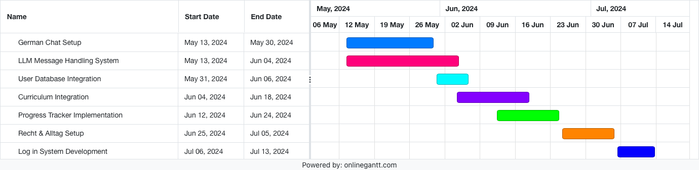
*Image: Gantt-Diagram - Timeline*

# (C1, E3) Description of the System

## German
Our German learning module focuses on developing users' writing, reading and listening skills through a series of interactive and adaptive lessons. The intelligent tutoring system we have developed not only provides traditional learning content such as grammar explanations, reading and listening texts, but also creates exercises for each lesson. These exercises include single-choice, gap-filling and open-ended questions, all generated by the language model. 
The intelligent system understands German, English, Russian, Ukrainian, Arabic and Turkish. Users can also choose to have all system messages translated into their preferred language.


*Image 1: Introductory message, Image 2: Single-choice question, Image 3: Open-ended question, Image 4: Widget of a listening*


*Image 1: Grammar explanation, Image 2: Grammar explanation, Image 3: Gap-filling exercise*

In addition, the tutoring system enables a dialogue-based learning approach. Users can ask questions in real time about grammatical details, the meaning of expressions, or for more examples. The system also offers situational phrase help to help users apply and deepen their language skills in different everyday situations.


*Image 1: Widget of a listening exercise, Image 2: Example of a question on the grammar, Image 3: Example of phrase help*

This interactive and user-centred approach ensures that each learner is supported individually and can progress effectively according to the A2 syllabus.

## Law and Politics

Our law and politics curriculum is designed as an interactive question catalogue. Users can choose from a list of questions covering both legal and political topics. After selecting a question, detailed information on the topic is displayed. There is also the option to enter into a dialogue with our chatbot and explore the topic in more depth.


*Image 1: Introductory message, Image 2: Legal questions, Image 3: Anti-discrimination questions*


\
*Image: Question catalogue categories*

The chatbot only answers using information from a knowledge base that we have manually compiled based on official guidelines and guidance. This is to ensure accurate and reliable answers that help learners develop a sound understanding of Germany's legal foundations and political structures.

\
*Image: Example of a chatbot response*

# (B3) Risk Management

## Possible risks

### Availability of team members

Two of the four team members have jobs in addition to their studies and are not able to work consistently and continuously on the project

###  Lack of protection layers in the LLM used

The responses from the open source LLM we use are not filtered and validated, which can lead to misuse of the application.

## Weighting of the identified risks

### Availability of team members

There is a high probability that the bulk of the work will fall on half the team. This may limit the amount of functionality we can implement during the semester.

### Lack of protection layers in the LLM used

We consider the likelihood of unfair use of LLMs to be imminent. We consider the elimination of this problem to be a priority.

## Strategies for each identified risk

### Availability of team members


Tasks are initially distributed unevenly to avoid unforeseen delays in the completion of tasks by team members who cannot work on the project all the time.  

### Lack of protection layers in the LLM used

Using prompt engineering methods, we build a layer of protection that minimises the risk of unfair and unintended use of LLM functionality.

# (C3, D2) Non-Functional Requirements

## Technic Requirements
### Technology Stack:
- **OS:** Android, IOS;
- **UI Stack:** Flutter
- **Backend Stack:** Typescript(NestJS), Python (Flask)
- **Data Storage:** MilvusDB, PostgreSQL

### Tools, API & Software:
- **Version Control:** Git
- **Containerization:** Docker, Kubernetes
- **API Dependencies**: Deepl, OpenSearch
- **LLM Hosting:** AWS Bedrock

## Code-Conventions
- **PEP 8 Standard for Python-Code.** 
- **Use of Linters (e.g. pylint).** 
- **DocStrings style: NumPy**
---
# (C2) Use Cases
## Use Case Diagram
[](general/use_cases.png) 
*Image: Use-Case-Diagram*
## Definitions

**Progress tracker** is a component within the German chat interface that monitors, records, and displays a user's progress through users messages and task completion.

**Learning State** refers to the current status of a user's progress in the curriculum determined by their interactions with the app. It is updated dynamically based on user actions such as sending messages, completing tasks. It consists of already learned topics defined in the curriculum with the sccores for each topic. 

**Curriculum** is organized in a graph structure, where each node represents a specific learning objective or topic, and edges between nodes indicate prerequisite relationships. Each node has other metadata such as type (e.g. Grammar or Vocabulary).

## Table of contents
<!-- TOC start -->
- [Welcome Screen](#welcome-screen)
   - [1a. Log in](#1a-authentication-log-in-optional)
   - [1b. Create New account](#1b-authentication-new-account-optional)
   - [1c. First Time Login Guide (Optional)](#1c-guide-new-account-optional)
   - [1d. Navigate Main Menu](#1d-interaction-with-main-menu)
- [Chat with German Bot](#chat-with-german-bot)
   - [2a. Send Message & Get Response](#2a-send-a-message-get-a-response)
   - [2b. Restore Message History](#2b-restore-the-message-history)
   - [2c. Start New Lesson](#2c-start-a-new-lesson)
   - [2d. Automatic translation](#2d-automatic-translation)
   - [2e. Complete Tasks](#2e-task-widget)
   - [2f. View Progress (Optional)](#2f-progress-tracker)
   - [2g. Update Learning State (Optional)](#2g-update-learning-state)
   - [3. Persisting Message Data](#3-persisting-message-data-in-the-data-base)
- [Chat with Recht und Alltag Bot](#chat-with-recht-und-alltag-bot)
   - [4a. Send Message & Get Response](#4a-send-a-message-get-a-response)
<!-- TOC end -->

<!-- TOC --><a name="welcome-screen"></a>
## Welcome Screen

<!-- TOC --><a name="1a-authentication-log-in-optional"></a>
### 1a. Log in

**Actor:** User

**Goal:** Securely log into the system using a username and password.

**Prerequisites**: User is not logged in.

**Basic Flow:**

---

=> The user enters their username and password.

=> The system validates the credentials.

=> Upon successful validation, the user is granted access to the system.

=> If the credentials are incorrect, the user is prompted either to create a new account or try again.

---

<!-- TOC --><a name="1b-authentication-new-account-optional"></a>
### 1b. Create New Account

**Actor:** User

**Goal:** To securely log into the system using a username and password for the first time.

**Basic Flow:**

---

=> The user presses on "Create new account" in the welcome menu.

=> The user enters their username and password.

=> New account details are added to the database with user data.

---

<!-- TOC --><a name="1c-guide-new-account-optional"></a>
### 1c. First Time Login Guide (Optional)

**Actor:** User

**Goal:** To get first impressions for the system.

**Prerequisites**: User is logged in for the first time.

**Basic Flow:**

---

=> The system displays a widget with a welcome message & a button 'Continue'.

=> After pressing the continue button, the system suggests the user to select the interface language.

=> After selecting a language, all the system elements will be displayed in the selected language.

=> A further widget with information about 2 interfaces ('German chat' and 'Recht & Alltag’) is displayed. 

=> A next widget tells the user about learning German with the app and  the main functionalities such as chat interface, buttons, tasks widgets, translation and progress tracker.

---

<!-- TOC --><a name="1d-interaction-with-main-menu"></a>
### 1d. Navigate Main Menu

**Actor:** User

**Goal:** To naviagate between the different components in the main menu.

**Prerequisites**: User is logged into the app.

**Basic Flow:**

---

=> The system displays a screen with a welcome message, buttons "Deutsch" and "Recht & Alltag" at the bottom of the screen. At the top right corner there is a setting icon. 

=> After pressing the button, the according chat interface is displayed.

=> After pressing on a setting icon, the user can adjust their language.

---

<!-- TOC --><a name="chat-with-german-bot"></a>
## Chat with German Bot

<!-- TOC --><a name="2a-send-a-message-get-a-response"></a>
### 2a. Send Message & Get Response

**Actor:** User

**Goal:** Send a message to a German bot.

**Prerequisites**: User is logged in.

**Basic Flow:**

---

=> The user presses a button 'Deutsch'.

=> A chat interface with the welcome message appears.

=> The user sends a message or question to the German bot.

=> The user sees 3 dots appearing on the screen to indicate message preprocessing.

=> The sent message with metadata are persisted to a SQL data base.

=> The system processes the request using AI-based System to understand and generate a response.

=> the system respnse with a metadata is persisted to a SQL data base as well.

=> The system display the response in the chat.

=> If the message contains audio, an audio player component is displayed under the message.

---

<!-- TOC --><a name="2b-restore-the-message-history"></a>
### 2b. Restore Message History

**Actor:** System

**Goal:** To see the message history from the previous sessions.

**Prerequisites**: User is logged in and there are messages from this user in the data base from the last session.

**Basic Flow:**

---

=> The user presses a button 'Deutsch'.

=> The system fetches the message history from the data base and displays it in the chat insterface.

---

<!-- TOC --><a name="2c-start-a-new-lesson"></a>
### 2c. Start New Lesson

**Actor:** User

**Goal:** To start a new lesson.

**Prerequisites**: User is logged in and navigated to the german chat interface.

**Basic Flow:**


---

=> The system displays the message history and the new message with a button under the message 'New lesson'. 

=> The user presses a button to start a new lesson.

=> The system uses AI to generate tasks based on the user's progress and a retrieved topic from the curriculum.

=> The user completes the tasks and views corrections and asks for explanations where necessary.

=> If all tasks are done and there is no question, the system informs the user that they completed the lesson.


---

<!-- TOC --><a name="2d-automatic-translation"></a>
### 2d. Automatic Translation

**Actor:** User

**Goal:** To see the translation.

**Prerequisites**: User is logged in and and navigated to the german chat interface.

**Basic Flow:**


---

=> The user sends a message to the system and gets a response.

=> Under the system message is a small standard translation icon displayed.

=> The user presses the icon button.

=> The system tranlates a message into the selected interface language.


---

<!-- TOC --><a name="2e-task-widget"></a>
### 2e. Complete Tasks

**Actor:** User

**Goal:** Complete the tasks.

**Prerequisites**: User is logged in and and navigated to the german chat interface, system generated a set of tasks.

**Basic Flow:**


---

=> The user clicks the "tasks" button under the system message to open the task widget. It can be multiple choice questions, open questions and fill the gap tasks.

=> System displays tasks relevant to the current learning context.

=> User can swipe left or click "back" to return to the main chat interface any time, the current progress is saved. 

=> System logs task completion to progress tracker and switches back to the main chat interface.


---

<!-- TOC --><a name="2f-progress-tracker"></a>
### 2f. View Progress (Optional)

**Actor:** User

**Goal:** To see the current progress.

**Prerequisites**: User is logged in and and navigated to the german chat interface.

**Basic Flow:**


---

=> The user selects to view the curriculum and clicks the icon of a graph at top right corner of the screen.

=> The system display the progress of the user in form of table of contents with different header styles. 

=> The unit with the lowest header level has a progress bar displaying a user progress. 


---

<!-- TOC --><a name="2g-update-learning-state"></a>
### 2g. Update Learning State (Optional)

**Actor:** System

**Goal:** To update learning state.

**Prerequisites**: User sent a message to system or completed tasks.

**Basic Flow:**


---

=> After each user message, the system checks the spelling and grammar mistakes and matches the mistakes with the according elements from the curriculum.

=> The learning state is updates.

=> The progress tracker updates the progress interface (2f).


---

<!-- TOC --><a name="3-persisting-message-data-in-the-data-base"></a>
### 3. Persisting Message Data

**Actor:** System

**Goal:** To save message history.

**Prerequisites**: User sent a message to the system.

**Basic Flow:**


---

=> The system creates a DTO object including message text, timestamp, generated message_id, username, role. 

=> The system persists data into a SQL data base.


---

<!-- TOC --><a name="chat-with-recht-und-alltag-bot"></a>
## Chat with Recht und Alltag Bot

<!-- TOC --><a name="4a-send-a-message-get-a-response"></a>
### 4a. Send Message & Get Response

**Actor:** User

**Goal:** Send a message to a Law & Daily life microservice.

**Prerequisites**: User is logged in.

**Basic Flow:**


---

=> The user presses a button 'Recht & Alltag'.

=> A chat interface with the welcome message appears.

=> The user sends a message or question to the bot.

=> The user can attach a PDF to their message. 

=> The sent message with metadata are persisted to a SQL data base.

=> The system processes the request using Retrieval-Augmented Generation System to generate a response based on the data in the vectordatabase.

=> The system response with a metadata is persisted to a SQL data base as well.

=> The system display the response in the chat.

---
# Software Architecture


# (D1) Architecture Overview
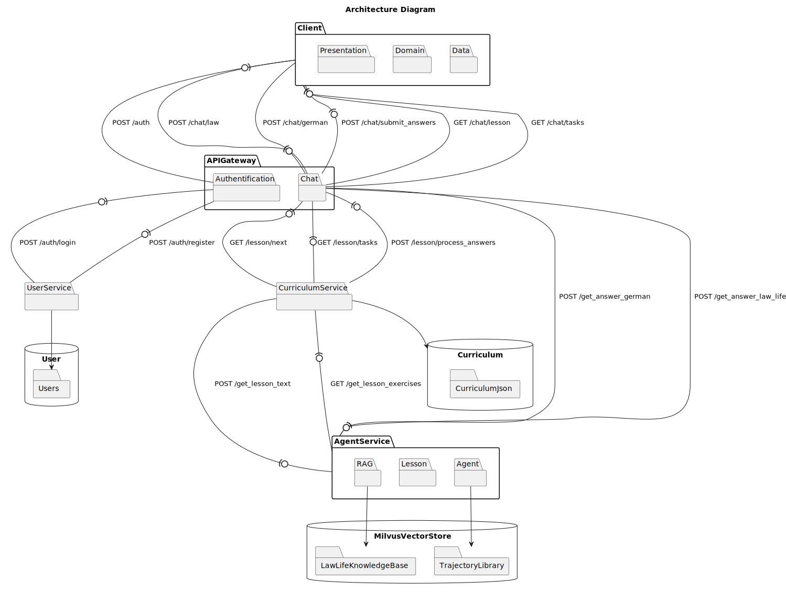
*Image: Architecture-Diagram (abstracted)*
# (D3, F2) Frontend Overview

This document provides an overview of the frontend part of the application built using Flutter.

We used Flutter as we found it to be the most suitable framework for rapid cross-platform prototyping. It eliminates the need for a JS, HTML, CSS stack and allows you to add components with minimal code.

## Project Structure

- **data/**: Contains models, repositories, and data providers.
- **domain/**: Contains entities, repositories, and use cases.
- **presentation/**: Contains blocs, screens, widgets, and routes.

## Main Entry Point

- **main.dart**: The entry point of the Flutter application.

## Components
We used **Clean Architecture** Pattern as a template.
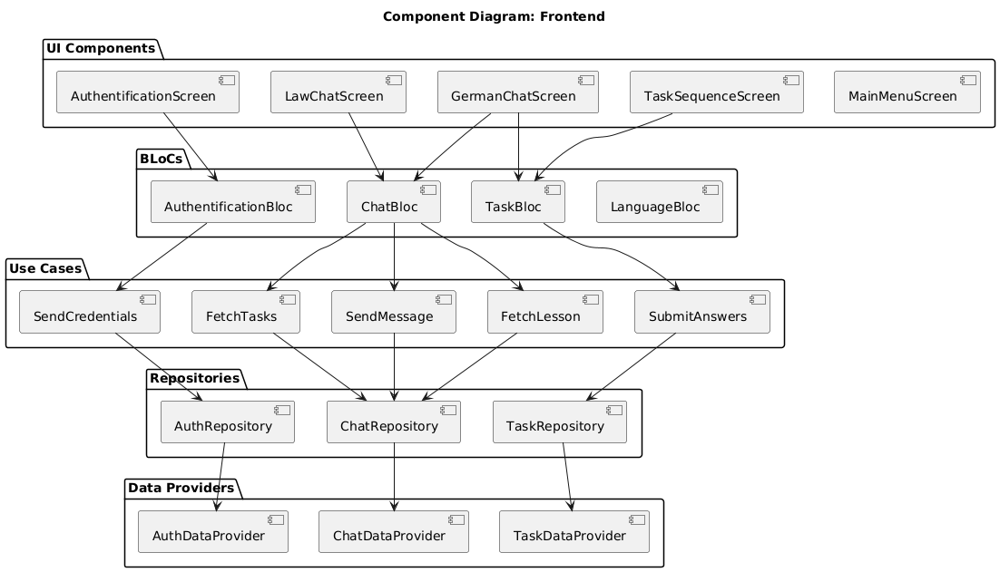
*Image: Frontend Component-Diagram (abstracted)*
## Key Visual Screens

## Authentication Screen (`authentification_screen.dart`)
- **Purpose**: Handles user authentication (login/register).

[](frontend/res/auth_screen.jpg)

## Main Menu Screen (`main_menu_screen.dart`)
- **Purpose**: Central hub for navigating to different parts of the app.

[](frontend/res/main_screen.png)

## German Chat Screen (`german_chat_screen.dart`)
- **Purpose**: Facilitates chats to learn German and complete German learning lessons.

[](frontend/res/german_screen.png)

## Law Chat Screen (`law_chat_screen.dart`)
- **Purpose**: Facilitates chats related to legal advice or queries.

[](frontend/res/law_screen.jpg)

## State Management

This application uses the BLoC (Business Logic Component) pattern for state management. Each BLoC handles a specific part of the application's state and business logic.

### BLoC Overview

- **Authentification BLoC**: Manages user authentication state.
- **Chat BLoC**: Manages the state of chat interactions.
- **Task BLoC**: Manages language learning tasks screens within the German chat.
- **Language Management BLoC**: Manages switching between differen languages for the UI components.

### Authentification BLoC
#### Overview
The Authentification BLoC manages the state for user authentication, including login and registration.

#### Sequence Diagram
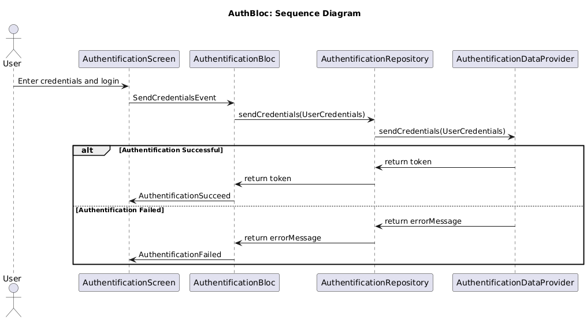
*Image: Sequence-Diagram - Auth-Bloc*
#### Dependencies
- **SendCredentials**: Use case for submitting user credentials.

#### Events
#### SendCredentialsEvent
- **Properties**: `username`, `password`, `isSignUp`
- **Description**: Triggered when the user submits their credentials.

#### States
#### AuthentificationRequired
- **Description**: Initial state.

#### AuthentificationPending
- **Description**: State when authentication is in progress.

#### AuthentificationSucceed
- **Properties**: `sessionToken`
- **Description**: State when authentication is successful.

#### AuthentificationFailed
- **Properties**: `errorMessage`
- **Description**: State when authentication fails.

### ChatBloc

#### Overview
The `ChatBloc` is responsible for managing the state and business logic of chat interactions within the application. It handles events related to sending messages, sending images, fetching lessons, fetching tasks, and initializing chat sessions.

#### Sequence Diagram
**German Chat**

*Image: Sequence-Diagram - German Chat-Bloc*
**Law & Politcs Chat**

*Image: Sequence-Diagram - Law & Politics Chat-Bloc*
#### Dependencies
- **SendMessage**: Use case for sending text messages.
- **SendImage**: Use case for sending image messages.
- **FetchLesson**: Use case for fetching a lesson within the chat.
- **FetchTasks**: Use case for fetching tasks related to the lesson.

#### States

#### ChatInitial
- **Description**: The initial state of the chat when no actions have been taken.

#### ChatLoading
- **Description**: State when chat-related data (messages, lessons, tasks) is being fetched or processed.

#### ChatLoaded
- **Description**: State when chat messages have been successfully loaded and displayed.

#### TaskLoaded
- **Description**: State when tasks associated with the chat have been successfully loaded.

#### LessonLoaded
- **Description**: State when a lesson within the chat has been successfully loaded.

#### ChatError
- **Description**: State representing an error that occurred during chat operations.

#### Events

##### InitializeChatEvent
- **Description**: Triggers the initialization of a chat session, fetching the message history.
- **Properties**:
  - `chatID`: The identifier of the chat to initialize.

##### SendMessageEvent
- **Description**: Triggers the sending of a text message.
- **Properties**:
  - `chatID`: The identifier of the chat.
  - `content`: The content of the message.

##### SendImageEvent
- **Description**: Triggers the sending of an image message.
- **Properties**:
  - `chatID`: The identifier of the chat.
  - `path`: The path to the image file.

##### FetchLessonEvent
- **Description**: Triggers the fetching of a lesson within the chat.
- **Properties**:
  - `chatID`: The identifier of the chat.

##### ProposeLessonEvent
- **Description**: Used to propose a new lesson if the previous lesson is completed.
- **Properties**:
  - `previousLessonCompleted`: A boolean indicating if the previous lesson was completed.
  - `chatID`: The identifier of the chat.

##### ClearChatEvent
- **Description**: Triggers clearing of the chat history.
- **Properties**:
  - `chatID`: The identifier of the chat to clear.

##### FetchTaskEvent
- **Description**: Triggers fetching tasks associated with the chat.
- **Properties**:
  - `chatID`: The identifier of the chat.

### Task BLoC

#### Overview
The Task BLoC manages the state of tasks within the chat, especially for the German chat.

#### Sequence Diagram
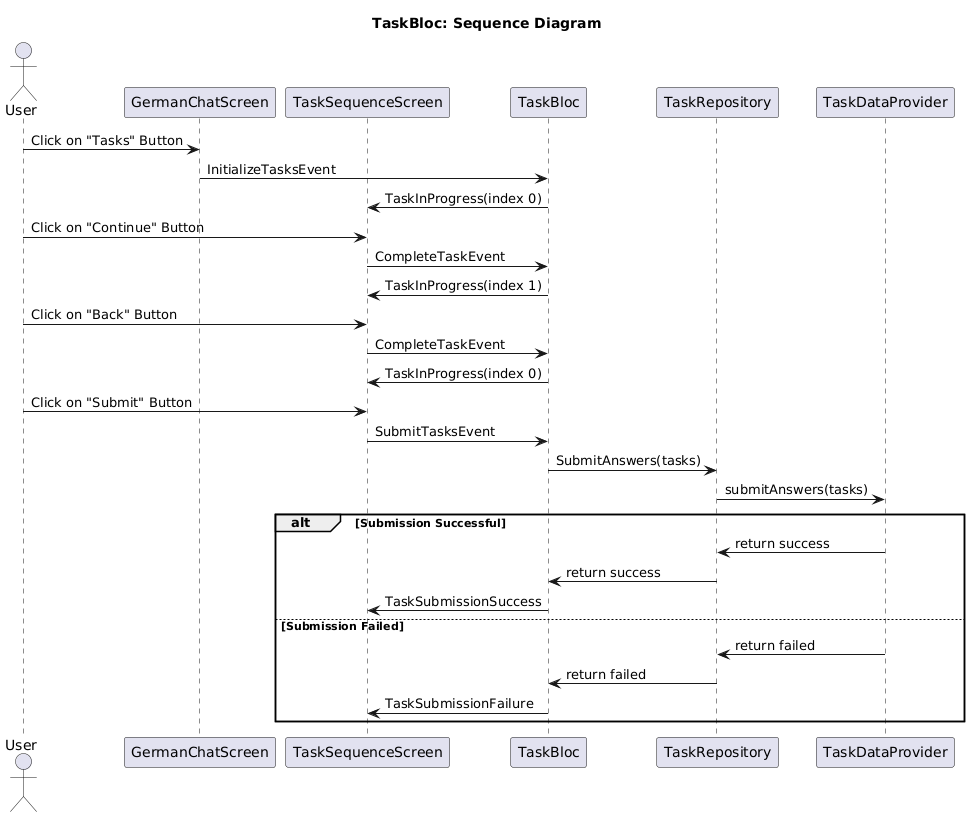
*Image: Sequence-Diagram -Task-Bloc*
#### Dependencies
- **SubmitAnswers**: Use case for submitting user answers.

#### Events
#### InitializeTasksEvent
- **Properties**: `tasks`
- **Description**: Triggered to initialize tasks.

#### CompleteTaskEvent
- **Properties**: `taskIndex`, `userAnswers`, `goForward`
- **Description**: Triggered when a task is completed.

#### SubmitTasksEvent
- **Properties**: `tasks`
- **Description**: Triggered to submit all tasks.

#### UpdateTaskAnswerEvent
- **Properties**: `userAnswers`
- **Description**: Triggered to update answers for the current task.

#### States
##### TaskInitial
- **Description**: Initial state of the task BLoC.

##### TaskInProgress
- **Properties**: `tasks`, `currentTaskIndex`
- **Description**: State when tasks are in progress.

##### TaskSubmissionInProgress
- **Description**: State when task submission is in progress.

##### TaskSubmissionSuccess
- **Description**: State when task submission is successful.

#### TaskSubmissionFailure
- **Properties**: `errorMessage`
- **Description**: State when task submission fails.

# (D3, F2) Backend Overview
For the server part we chose a microservice architecture consisting of four services:

- **API Gateway**: Entry point for all client requests.
- **Curriculum Microservice**: Manages curriculum-related operations and data for fetching lesson topics & updating progress.
- **User Microservice**: Handles user-related operations and data.
- **Agent Microservice**: Python-based microservice for specialized tasks such as LLM-driven question-answering, lesson & exercises creation.

## Architecture

Each microservice is designed to be independent and scalable, with its own database or/and dependencies.

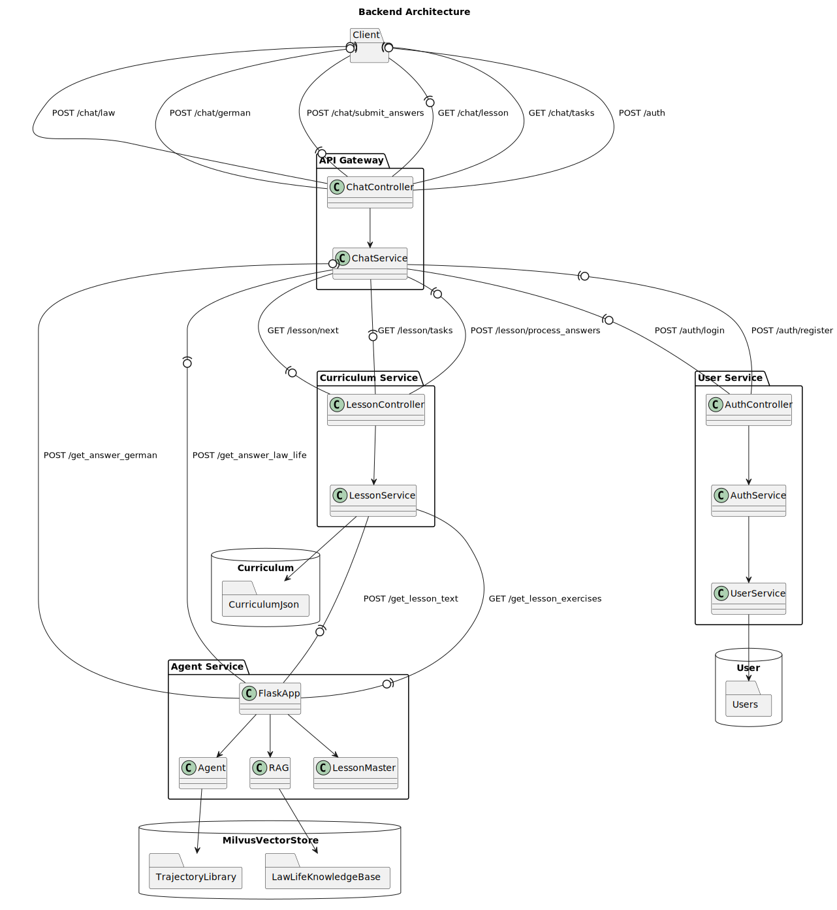
*Image: Architecture-Diagram - Backend (abstracted)*
## Communication

- **API Gateway**: Uses HTTP/REST for communication with other services.
- **Inter-Service Communication**: Handled via HTTP/REST.

## Technologies

- **NestJS**: Used for API Gateway, Curriculum Microservice, and User Microservice.
- **Python (Flask)**: Used for the Agent Microservice.

## Documentation
## API Gateway Overview

The API Gateway is the entry point for all client requests in the microservice architecture. It routes requests to the appropriate microservice.

### Responsibilities

- Routing client requests to the appropriate microservice.
- Performing request validation and response formatting.
- Aggregating responses from multiple services when necessary.

## API Gateway Architecture

The architecture of the API Gateway is illustrated in the following diagram:

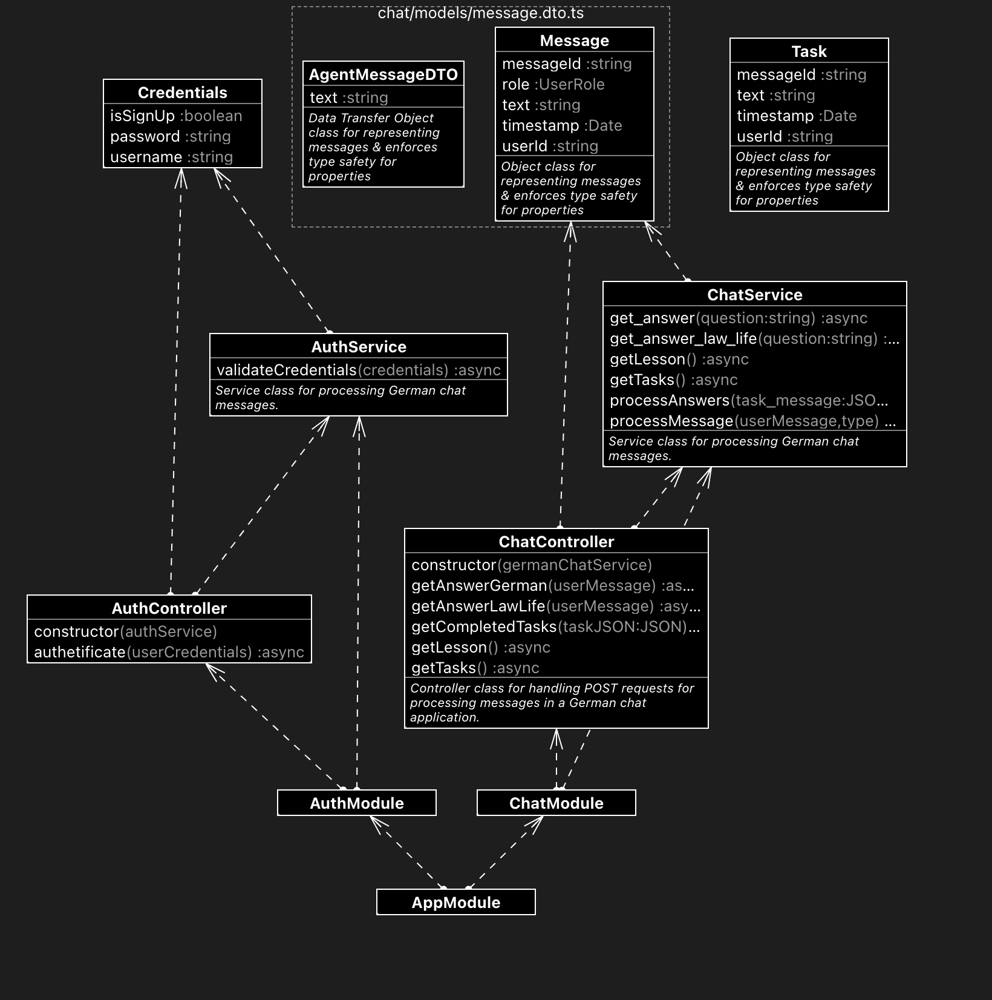
*Image: Class-Diagram - API-Gateway*

### Services Interacted With

- **Curriculum Microservice**: Manages curriculum-related operations and data.
- **User Microservice**: Handles user-related operations & authentification and data.
- **Agent Microservice**: Performs specialized tasks such as LLM-driven question-answering, lesson & exercises creation.

## Agent Microservice Overview

The Agent Microservice is a Python-based service designed to perform specialized tasks such as LLM-driven question-answering, lesson & exercises creation. This microservice processes user queries, performs reasoning, and uses various tools to generate responses.

### Responsibilities

- Processing complex queries and generating answers using tools like text translation, web search, and phrasing support.
- Generating reading & listening for German learning.
- Retrieving the grammar explanations. 
- Generating & validating the exercises for German learning.
- Retrieving relevant documents on legal and political aspects, generating an answer based on retrieved information.

### Services Interacted With

- **API Gateway**: Routes requests from clients to the agent microservice.
- **Curriculum Microservice**: Provides lessons and exercises for curriculum-related queries.

### Agent Microservice Architecture

The architecture of the Agent Microservice is illustrated in the following diagram:


*Image: Class-Diagram - Agent Microservice*

## Components
### Entry point
**FlaskApp**: The main application handling HTTP requests.

### Agent
Performs the reasoning and query processing for queries related to German learning.
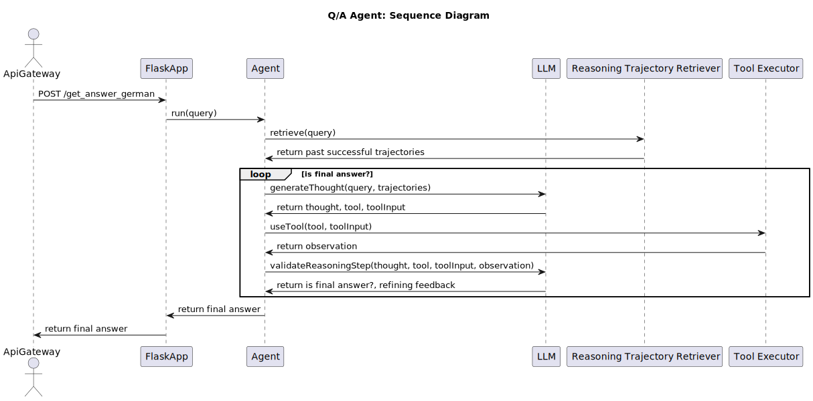
*Image: Sequence-Diagram: Q&A Agent - German Learning*

### Retrieval-Augmented Generation
Retrieval-Augmented Generation for handling queries related to law and politics.
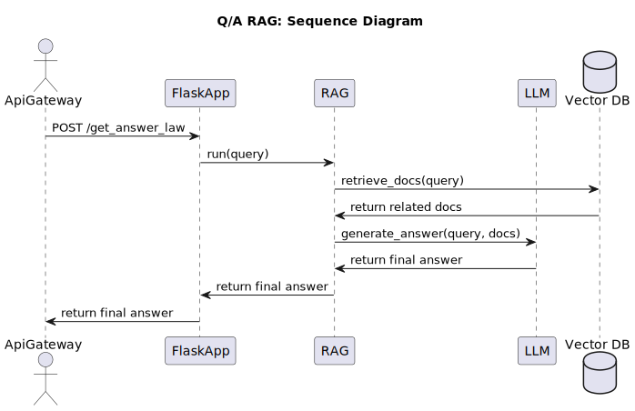
*Image: Sequence-Diagram: Q&A RAG - Law & Politics*

### LessonMaster 
Manages lesson & exercise generation on a defined topic.
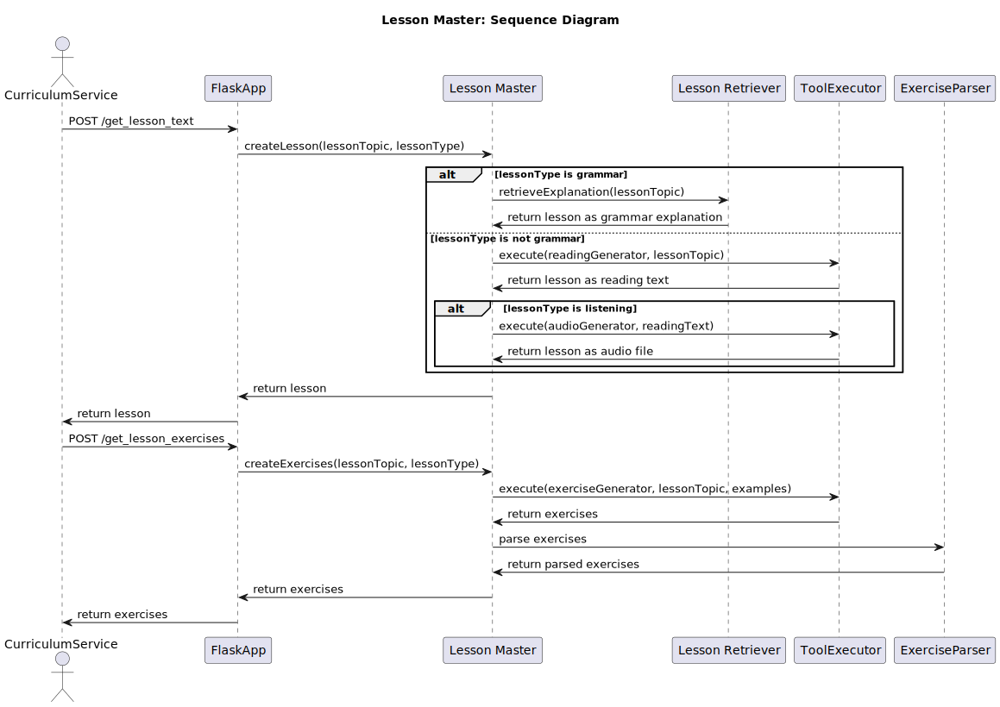
*Image: Sequence-Diagram: Lesson Creation - German Learning*

## Curriculum Microservice Overview

The Curriculum Microservice manages curriculum-related operations and data. It provides endpoints for creating lessons and tasks & updating user progress.

### Responsibilities

- Retrieving next uncompleted topic.
- Providing endpoints for curriculum operations.
- Processing user answers & updating user progress.

### Services Interacted With

- **API Gateway**: Routes requests from clients to the curriculum microservice.
- **Agent Microservice**: Performs specialized tasks such as LLM-driven question-answering, lesson & exercises creation.

## Curriculum Microservice Architecture

The architecture of the Curriculum Microservice is illustrated in the following diagram:

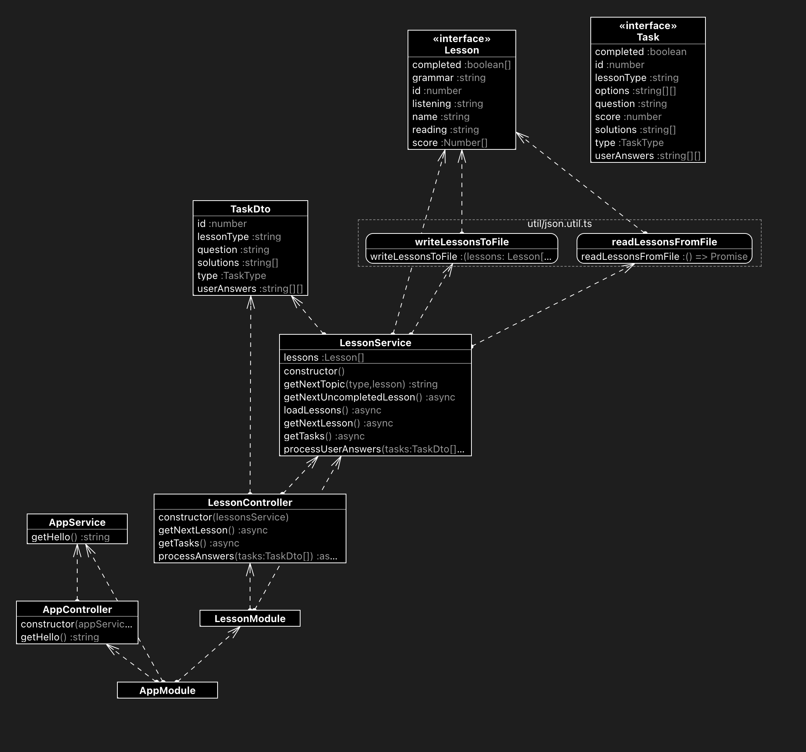
*Image: Class-Diagram: Curriculum Microservice*

## User Microservice Overview

The User Microservice handles user-related operations and data. It provides endpoints for user registration, authentication.

### Responsibilities

- Managing user accounts and profiles.
- Handling user authentication and registration.

### Services Interacted With

- **API Gateway**: Routes requests from clients to the user microservice.

## User Microservice Architecture

We used hexagonal architecture pattern as a template. The architecture of the User Microservice is illustrated in the following diagram:

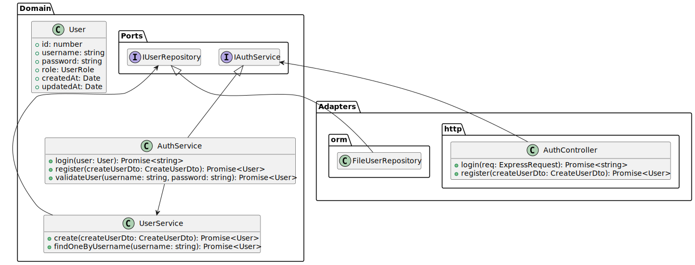
*Image: Class-Diagram (abstracted): User Microservice*

# (D3, F2) API Documentation

## Table of Contents
- [API Gateway](#api-gateway)
  - [Authentication Endpoints](#authentication-endpoints)
    - [`POST /auth`](#post-auth)
  - [Chat Endpoints](#chat-endpoints)
    - [`POST /chat/german`](#post-chatgerman)
    - [`POST /chat/law`](#post-chatlaw)
    - [`GET /chat/lesson`](#get-chatlesson)
    - [`GET /chat/tasks`](#get-chattasks)
    - [`POST /chat/submit_answers`](#post-chatsubmit_answers)
- [User Microservice](#user-microservice)
  - [Auth Endpoints](#auth-endpoints)
    - [`POST /auth/login`](#post-authlogin)
    - [`POST /auth/register`](#post-authregister)
- [Curriculum Microservice](#curriculum-microservice)
  - [Lesson Endpoints](#lesson-endpoints)
    - [`GET /lesson/next`](#get-lessonnext)
    - [`GET /lesson/tasks`](#get-lessontasks)
    - [`POST /lesson/process_answers`](#post-lessonprocess_answers)
- [Agent Microservice](#agent-microservice)
  - [Agent Endpoints](#agent-endpoints)
    - [`POST /get_answer_german`](#post-get_answer_german)
    - [`POST /get_answer_law`](#post-get_answer_law)
    - [`POST /get_lesson_text`](#post-get_lesson_text)
    - [`GET /get_lesson_exercises`](#get-get_lesson_exercises)
---

## API Gateway

### Authentication Endpoints

#### `POST /auth`

- **Description**: Authenticates a user.
- **Request Body**:
  ```json
  {
    "username": "string",
    "password": "string",
    "isSignUp": "bool"
  }
  ```
- **Response**:
    ```json
    {
    "accessToken": "string"
    }
    ```
### Chat Endpoints
#### `POST /chat/german`
- **Description**: Processes a German chat message.
- **Request Body**:
  ```json
  {
    "userId": "string",
    "messageId": "string",
    "role": "user",
    "timestamp": "string",
    "text": "string"
  }
  ```
- **Response**:
    ```json
    {
    "message": "string"
    }
    ```
#### `POST /chat/law`
- **Description**: Processes a "Law & Politics" chat message.
- **Request Body**:
  ```json
  {
    "userId": "string",
    "messageId": "string",
    "role": "user",
    "timestamp": "string",
    "text": "string"
  }
  ```
- **Response**:
    ```json
    {
    "message": "string"
    }
    ```
#### `GET /chat/lesson`
- **Description**: Get next German lesson. 
- **Response**:
    ```json
    {
    "text": "string",
    "audio": "string",
    "video": "string",
    "type": "string"
    }
    ```
#### `GET /chat/tasks`
- **Description**: Get a list of tasks for a generated lesson.
- **Response**:
    ```json
    {
    "tasks": [
        {
        "type": "TaskType",
        "id": 1,
        "lessonType": "string",
        "question": "string",
        "userAnswers": [["string"]],
        "solutions": ["string"]
        },
    ],
    "type": "string",
    "id": "int"
    }
    ```
#### `POST /chat/submit_answers`
- **Description**: Submit user answers for the generated tasks.
- **Request Body**:
    ```json
    {
    "tasks": [
        {
        "type": "TaskType",
        "id": "int",
        "lessonType": "string",
        "question": "string",
        "userAnswers": [["string"]],
        "solutions": ["string"],
        "lessonType": "string",
        },
    ],
    }
    ```

## User Microservice
### Auth Endpoints
#### `POST /auth/login`

- **Description**: Authenticates a registered user.
- **Request Body**:
  ```json
  {
    "username": "string",
    "password": "string",
  }
  ```
- **Response**:
    ```json
    {
    "accessToken": "string"
    }
    ```
#### `POST /auth/register`

- **Description**: Authenticates a new user.
- **Request Body**:
  ```json
  {
    "username": "string",
    "password": "string",
  }
  ```
- **Response**:
    ```json
    {
    "accessToken": "string"
    }
    ```

## Curriculum Microservice
### Lesson Endpoints
#### `GET /lesson/next`
- **Description**: Get next German lesson. 
- **Response**:
    ```json
    {
    "text": "string",
    "audio": "string",
    "video": "string",
    "type": "string"
    }
    ```
#### `GET /lesson/tasks`
- **Description**: Get a list of tasks for a generated lesson.
- **Response**:
    ```json
    {
    "tasks": [
        {
        "type": "TaskType",
        "id": 1,
        "lessonType": "string",
        "question": "string",
        "userAnswers": [["string"]],
        "solutions": ["string"]
        },
    ],
    "type": "string",
    "id": "int"
    }
    ```
#### `POST /lesson/process_answers`
- **Description**: Submit user answers for the generated tasks.
- **Request Body**:
    ```json
    {
    "tasks": [
        {
        "type": "TaskType",
        "id": "int",
        "lessonType": "string",
        "question": "string",
        "userAnswers": [["string"]],
        "solutions": ["string"],
        "lessonType": "string",
        },
    ],
    }
    ```

## Agent Microservice
### Agent Endpoints
#### `POST /get_answer_german`
- **Description**: Processes a German chat message.
- **Request Body**:
  ```json
  {
    "question": "string"
  }
  ```
- **Response**:
    ```json
    {
    "answer": "string"
    }
    ```
#### `POST /get_answer_german`
- **Description**: Processes a "Law & Politics" chat message.
- **Request Body**:
  ```json
  {
    "question": "string"
  }
  ```
- **Response**:
    ```json
    {
    "answer": "string"
    }
    ```
#### `POST /get_lesson_text`
- **Description**: Get next German lesson.
- **Request Body**:
  ```json
  {
    "request": "string"
  }
  ``` 
- **Response**:
    ```json
    {
    "text": "string",
    "audio": "string",
    "video": "string",
    }
    ```
#### `GET /get_lesson_exercises`
- **Description**: Get a list of tasks for a generated lesson.
- **Response**:
    ```json
    {
    "tasks": [
        {
        "type": "string",
        "id": 1,
        "lessonType": "string",
        "question": "string",
        "userAnswers": [["string"]],
        "solutions": ["string"]
        },
    ],
    }
    ```
# (E1, E2) Testing

## Goals for Test Coverage
### Code Coverage:
Our goal is to ensure that our tests cover all the possible branches and paths in the code. By focusing on branch coverage, we can identify and address any potential issues in the decision-making logic of the application. This type of coverage ensures that our tests are not just executing lines of code but are also evaluating the various conditions and outcomes that may arise during execution.

### Specification Coverage:
We aim to verify that all the specified requirements and use cases for the application are tested. By creating UI tests to cover the functional requirements, we ensure that the application is tested against its intended use cases. 

## Types of Tests Used
### Unit Tests:
- Focus on testing individual components or functions in isolation.
- Validate that each part of the code works correctly on its own.
### Integration Tests:
- Test the interactions between different components or systems.
- Ensure that the integrated parts of the application work together as expected.
### UI Tests:
- Based on our use cases, verify that the user interface behaves as expected.

## Test reports
### Agent Microservice
| Name                                                  | Stmts | Miss | Branch | BrPart | Cover |
|-------------------------------------------------------|-------|------|--------|--------|-------|
| agent_service/agent/agent.py                          | 121   | 33   | 20     | 6      | 67%   |
| agent_service/agent/agent_step.py                     | 25    | 0    | 2      | 0      | 100%  |
| agent_service/agent/llm.py                            | 58    | 24   | 0      | 0      | 59%   |
| agent_service/agent/reasoning_trace.py                | 71    | 7    | 22     | 4      | 86%   |
| agent_service/agent/task_type.py                      | 5     | 0    | 0      | 0      | 100%  |
| agent_service/agent/trajectory_library.py             | 55    | 38   | 12     | 0      | 25%   |
| agent_service/core/config.py                          | 31    | 10   | 6      | 1      | 65%   |
| agent_service/core/pydantic_agent.py                  | 6     | 0    | 0      | 0      | 100%  |
| agent_service/core/pydantic_llm.py                    | 13    | 0    | 0      | 0      | 100%  |
| agent_service/core/pydantic_tool.py                   | 7     | 0    | 0      | 0      | 100%  |
| agent_service/core/pydantic_tool_exe.py               | 11    | 0    | 0      | 0      | 100%  |
| agent_service/exceptions/lesson_exceptions.py         | 12    | 4    | 0      | 0      | 67%   |
| agent_service/exceptions/step_exception.py            | 9     | 0    | 0      | 0      | 100%  |
| agent_service/lesson/lesson_generation_retriever.py   | 43    | 7    | 8      | 1      | 84%   |
| agent_service/lesson/lesson_master.py                 | 44    | 13   | 6      | 2      | 66%   |
| agent_service/parsers/agent_step_parser.py            | 69    | 1    | 20     | 0      | 99%   |
| agent_service/parsers/exercises_parser.py             | 40    | 0    | 12     | 1      | 98%   |
| agent_service/prompts/prompt_builder.py               | 40    | 0    | 2      | 0      | 100%  |
| agent_service/prompts/react_prompt.py                 | 7     | 0    | 0      | 0      | 100%  |
| agent_service/prompts/task_generation_examples.py     | 6     | 0    | 0      | 0      | 100%  |
| agent_service/prompts/tool_prompt.py                  | 7     | 0    | 0      | 0      | 100%  |
| agent_service/rag/rag.py                              | 50    | 29   | 10     | 0      | 35%   |
| agent_service/tools/listening_generation_tool.py      | 28    | 14   | 6      | 0      | 41%   |
| agent_service/tools/no_answer_tool.py                 | 6     | 1    | 0      | 0      | 83%   |
| agent_service/tools/phrasing_tool.py                  | 8     | 3    | 0      | 0      | 62%   |
| agent_service/tools/reading_generation_tool.py        | 26    | 11   | 6      | 0      | 59%   |
| agent_service/tools/task_generation_tool.py           | 117   | 70   | 24     | 4      | 36%   |
| agent_service/tools/tool.py                           | 33    | 3    | 6      | 1      | 90%   |
| agent_service/tools/tool_executor.py                  | 42    | 13   | 6      | 0      | 65%   |
| agent_service/tools/tool_factory.py                   | 39    | 3    | 4      | 0      | 93%   |
| agent_service/tools/translator_tool.py                | 27    | 1    | 6      | 1      | 94%   |
| agent_service/tools/web_search_tool.py                | 41    | 0    | 8      | 0      | 100%  |
| agent_service/utils/document_handler.py               | 81    | 9    | 32     | 1      | 88%   |
| milvus_db/milvus_db.py                                | 26    | 17   | 8      | 0      | 26%   |
| **TOTAL**                                             | **1204** | **311** | **226** | **22** | **71%** |


### Curriculum Microservice

File                   | % Stmts | % Branch | % Funcs | % Lines | Uncovered Line #s 
-----------------------|---------|----------|---------|---------|-------------------
**All files**             |   **93.47** |    **83.33**|     **100**|   **92.77** |                   
 lesson                |    93.5 |    81.81 |     100 |   92.85 |                   
  lesson.controller.ts |     100 |      100 |     100 |     100 |                   
  lesson.service.ts    |   92.06 |    81.81 |     100 |   91.37 | 27,45-46,65-66    
 util                  |   93.33 |      100 |     100 |    92.3 |                   
  json.util.ts         |   93.33 |      100 |     100 |    92.3 | 16                

### API Gateway

File                 | % Stmts | % Branch | % Funcs | % Lines | Uncovered Line #s           
---------------------|---------|----------|---------|---------|-----------------------------
**All files**          |    **82.5** |      **100** |   **73.33** |   **81.25** |                             
 auth                |      80 |      100 |   33.33 |   76.92 |                             
  auth.controller.ts |   66.66 |      100 |       0 |      60 | 10,19-21                    
  auth.service.ts    |   88.88 |      100 |     100 |    87.5 | 36-37                       
 auth/models         |     100 |      100 |     100 |     100 |                             
  credentials.ts     |     100 |      100 |     100 |     100 |                             
 chat                |   82.14 |      100 |   83.33 |   81.25 |                             
  chat.controller.ts |   92.59 |      100 |   83.33 |      92 | 51-52                       
  chat.service.ts    |   77.19 |      100 |   83.33 |   76.36 | 66-67,91-92,115-116,139-154 

### User Microservice
File                      | % Stmts | % Branch | % Funcs | % Lines | Uncovered Line #s 
--------------------------|---------|----------|---------|---------|-------------------
All files                 |      50 |       24 |   29.41 |   49.15 |                   
 adapters/http            |   92.98 |    46.15 |     100 |    92.3 |                   
  auth.controller.ts      |     100 |      100 |     100 |     100 |                   
  user.controller.ts      |   90.24 |    46.15 |     100 |   89.47 | 39,50,61,65       
 adapters/orm             |       0 |        0 |       0 |       0 |                   
  file-user.repository.ts |       0 |        0 |       0 |       0 | 1-61              
 domain                   |   31.11 |        0 |       0 |      25 |                   
  auth.service.ts         |   36.84 |        0 |       0 |   29.41 | 11-34             
  user.service.ts         |   26.92 |        0 |       0 |   21.73 | 13-56

# (E1, E2) UI Tests

## Test Case 1a: Successful Login
**Description**: Verify that the user can successfully log in and authenticate.
**Prerequisites**: Register in the app with the username "aaa" and password "111".

**Steps:**

1. Open the application.
2. Enter the username "aaa" and password "111".
3. Ensure the "Sign up" checkbox is unchecked.
4. Click the "Submit" button.

**Expected Result:**
The main screen displays two buttons: "DEUTSCH!" and "RECHT & POLITIK".

**Actual Result:**
Consistent.

## Test Case 1b: Unsuccessful Login
**Description**: Verify that the error message is displayed when user credentials can't be found in the database.

**Steps:**

1. Open the application.
2. Enter the username "aab" and password "112er344t".
3. Ensure the "Sign up" checkbox is unchecked.
4. Click the "Submit" button.

**Expected Result:**
The error message is displayed.
**Actual Result:**
Consistent.


## Test Case 2: User Registration
**Description:** Verify that a new user can successfully register.

**Steps:**

1. Open the application.
2. On the "Welcome" screen, enter the username "sfEer" and password "3234566".
3. Check the "Sign up" checkbox.
4. Click the "Submit" button.

**Expected Result:**

Tthe main screen is displayed.
**Actual Result:**
Consistent.

## Test Case 3: Accessing German Chat Screen
**Description:** Verify that the user can navigate to the German chat screen.

**Steps:**
1. On the main screen, click the "DEUTSCH!" button.

**Expected Result:**

The user can see chat interface, a welcome message and a "New Lesson" button.

**Actual Result:**
Consistent.

## Test Case 4: Accessing Law and Politics Chat Screen
**Description:** Verify that the user can navigate to the Law and Politics chat screen.

**Steps:**

1. On the main screen, click the "RECHT & POLITIK" button.

**Expected Result:**

The user can see chat interface, a welcome message.
**Actual Result:**
Consistent.

## Test Case 5: Sending a Message in German Chat
**Description:** Verify that the user can send a message in the German chat.

**Steps:**

1. On the German chat screen, type a message "How can I say "I'd like to see a doctor?"?" in the chat input field.
2. Press the "Send" button.

**Expected Result:**
The application receives displays a response with the German translation in the chat history.

**Actual Result:**
Consistent.

## Test Case 6: Starting a New Lesson in German Chat
**Description:** Verify that the user can start a new lesson in the German chat.

**Steps:**

1. On the German chat screen, click the "New Lesson" button.

**Expected Result:**

The message with a lesson content on grammar is displayed.

**Actual Result:**
Consistent.

## Test Case 7: Accessing Tasks for a Lesson

**Description:** Verify that the user can access tasks for a generated lesson.

**Prerequisites:** The message with a lesson on grammar is displayed.

**Steps:**
1. After starting a new lesson, click on the "Tasks" button.

**Expected Result:**
The tasks are displayed, including their type, questions, and answer fields.

**Actual Result:**
Consistent.

## Test Case 8: Submitting Task Answers

**Description:** Verify that the user can submit answers for tasks.

**Prerequisites:** The displayed tasks are completed.

**Steps:**
1. Click the "Submit" button.

**Expected Result:**
The user is navigated back to the chat, a message offering to start a new lesson is appeared with a button "New lesson".

**Actual Result:**
Consistent.

## Test Case 9: Viewing a Question from the Law Chat

**Description:** Verify that the user can view the question list.

**Steps:**

1. On the Law chat screen, click on the hat icon at the top right corner.

**Expected Result:**

The user sees a list with possible questions.

**Actual Result:**
Consistent.


## Test Case 10: Selecting a Question from the Law Question View List
**Description:** Verify that the user can select a question from the question list and get the answer in the chat.

**Steps:**

1. On the Question View List, click on a question "Welche Bedeutung hat das Grundgesetz für die Bürgerrechte in Deutschland?" from the question list.

**Expected Result:**
The user is navigated back to the law chat screen.
The question is displayed in the chat history.
The application displays a response in the chat history.

**Actual Result:**
Consistent.

# (F1) Installation Guide
## Prerequisites

- Flutter SDK: [Flutter installation guide](https://flutter.dev/docs/get-started/install)
- Dart
- Python 3.10+
- pip
- Node.js
- NestJS CLI

## Steps

1. Clone the repository:
    ```sh
    git clone https://github.com/a-kholmovaia/aika.git
    ```
2. Navigate to the frontend directory:
    ```sh
    cd aika/frontend
    ```
3. Install dependencies:
    ```sh
    flutter pub get
    ```
4. Navigate to the agent-microservice directory:
    ```sh
    cd ../backend/agent-microservice/src
    ```
5. Install dependencies:
    ```sh
    pip install -r requirements.txt
    ```
6. Initialize the vector store:
    ```sh
    python -m scripts.init_milvus_db
    ```
7. Navigate to the api-gateway directory:
    ```sh
    cd ../backend/api-gateway
    ```
8. Install dependencies:
    ```sh
    npm install
    ```
9. Run tests:
    ```sh
    npm run test
    ```
10. Navigate to the directory:
    ```sh
    cd ../backend/curriculum-microservice
    ```
11. Install dependencies:
    ```sh
    npm install
    ```
12. Run tests:
    ```sh
    npm run test
13. Navigate to the directory:
    ```sh
    cd ../backend/user-microservice
    ```
14. Install dependencies:
    ```sh
    npm install
    ```
15. Run tests:
    ```sh
    npm run test
    ```

## Run Steps

### Frontend

1. Navigate to the frontend directory:
    ```sh
    cd aika/frontend
    ```
2. Run the app:
    ```sh
    flutter run
    ```
### Agent
1. Navigate to the agent-microservice directory:
    ```sh
    cd backend/agent-microservice/src
    ```
2. Run the service:
    ```sh
    flask run
    ```
### API-Gateway
1. Navigate to the directory:
    ```sh
    cd backend/api-gateway
    ```
2. Run the service:
    ```sh
    npm run start
    ```
### Curriculum-Microservice
1. Navigate to the directory:
    ```sh
    cd backend/curriculum-microservice
    ```
2. Run the service:
    ```sh
    npm run start
    ```
### User-Microservice
1. Navigate to the directory:
    ```sh
    cd backend/user-microservice
    ```
2. Run the service:
    ```sh
    npm run start
    ```

# (A3) Experience Report
- Solutions that turned out to be good
  1. Using microservices architecture for the back end
    * Implementing individual small microservices that communicate via HTTP requests proved to be quite simple and efficient. 
    * The microservices are independent, so it was possible to work on one task in parallel without waiting for the related task to be completed elsewhere in the system. 
    * It was possible to test the microservice independently.
  2. Using the Flutter framework for front-end prototyping
    * It was much easier to write code in Dart & build it on Android & IOS devices without writing platform specific code.
    * It was also easier to write Dart code for both the visual components and the custom logic without having 3 different code bases (HTML, CSS, JavaScript).
  3. Use of the NestJS framework for most microservices
    * It was easier to write server-specific logic (ORM, handling & sending HTTP requests) in NestJS than in Python. 
    * It was easier to write unit tests and mock objects and other microservices endpoints, generate detailed coverage reports and configure tests in NestJs than in Python.
  4. Move the progress tracker implementation out of the current prototype.
    * We found that the progress tracker implementation originally planned for the end of the prototype could distract our attention from the essential details of the application (agent-microservice, front-end) & make the overall software quality much worse.
  5. 3 modular independent parts in the agent microservice
    * Initially, we wanted to create a universal REACT agent for all 3 "AI" parts of the system. However, after evaluating the "universal" agents, we came to the conclusion that we should build 3 simpler modular parts for each user case: answering questions in German chat (React Agent), creating lessons (Lesson Master, hardcoded use of lesson creation tools) and basic RAG setup. All three parts became less complex and could be implemented and tested independently.
- Solutions that turned out to be bad:
  1. We tried to communicate with our third software developer, but still the tasks were very unevenly distributed and in the end we had to refactor the code for the user microservice, which was very time-consuming. That's why we didn't finish 2 tasks we had planned for this prototype:
    * (re)storing message history 
    * persisting user progress & messages in an SQL database. 
    - The code for these tasks was implemented on the client side and partly on the server side. 
    - We also noticed only at the end that the implemented test cases for the user microservice (the task was not assigned to us) had very low code coverage.
  2. Using Python for the agent microservice. 
    * Initially, we planned to use Python libraries for the agent and all LLM communication. However, in practice these libraries turned out to be "too" abstract and full of bugs, so we rewrote all the "AI" parts from scratch, using only AWS calls for communication with the LLM. So the original reason for using Python became obsolete. Our current implementation could also be done in Typescript, then we would use the same programming language and framework for all microservices.

# (A2) Summary

## Summary of the results achieved

### Summary of Results Achieved

- **User Authentication and Account Management:**
  - Implemented a secure login system allowing users to log in using a username and password.
  - Developed a user-friendly account creation process for new users.

- **Interactive German Language Chatbot:**
  - Enabled users to send messages to a German chatbot and receive AI-generated responses.
  - Integrated an audio and video player component for messages containing audio and video content.

- **Lesson Management and Task Completion:**
  - Developed an AI-driven lesson system that generates tasks based on user progress and curriculum topics.
  - Allowed users to complete various types of tasks (multiple-choice, open questions, fill-in-the-gap).
  - Enabled automatic translation of system messages into the user’s selected interface language.

- **Law and Daily Life Chatbot:**
  - Implemented a chatbot for legal and daily life queries using a Retrieval-Augmented Generation System.
  - Supported message attachments (PDFs) to enhance interaction and provide detailed responses.

- **User-Friendly Interface:**
  - Designed intuitive chat interfaces for both German language learning and law & daily life interactions.
  - Provided seamless navigation between chat interfaces and task widgets.

## Possible future work

To improve our learning app, we plan to implement and improve several key components:

+ **Persisting messages**: Persisting messages and responses in a SQL database for consistent data tracking.
+ **Progress Tracker Module**: The introduction of an enhanced progress tracking module will allow us to more accurately track users' learning progress in order to dynamically adapt the learning content.
+ **Improving task generation**: We aim to improve the quality of tasks.
+ **Generating tasks on request**: The development of a function that allows users to generate specific tasks - for example, ‘Create 5 tasks on the topic of perfect with “to be” for me’.
+ **Expansion of the curriculum**: We are planning to expand our German curriculum to include additional topics from levels A2 and B1.
+ **Trial language tests**: The introduction of trial language tests will help users to prepare for official language exams and evaluate their learning progress.
+ **Expansion of legal** and political topics: In addition, we want to expand our range of legal and political content to offer more specific content for different migrant groups.
