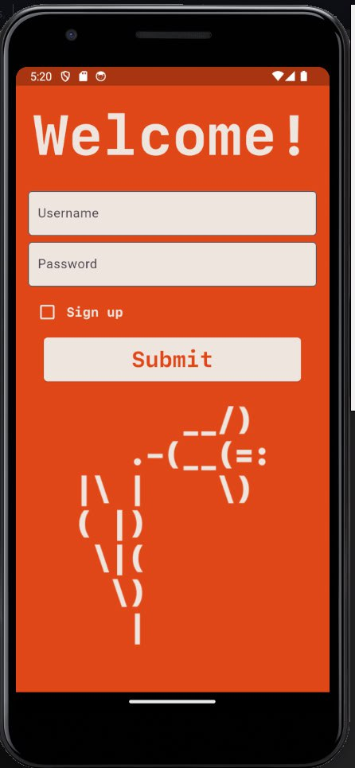
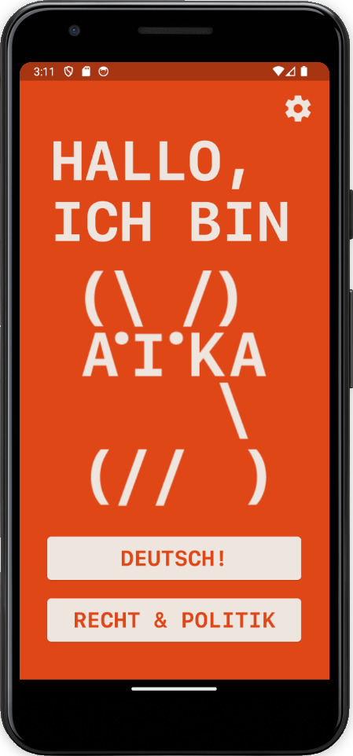
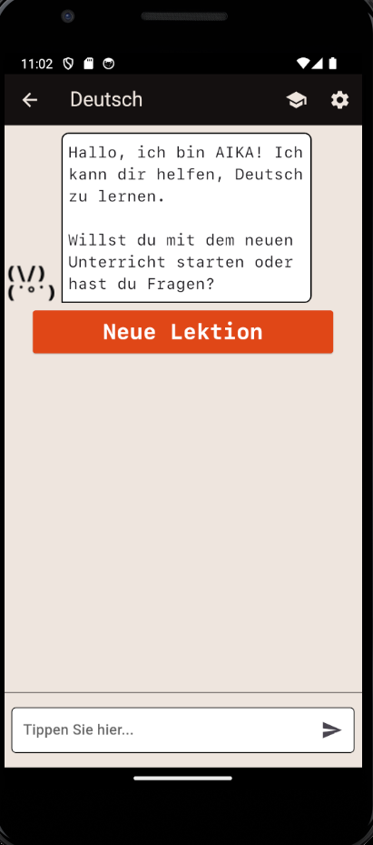
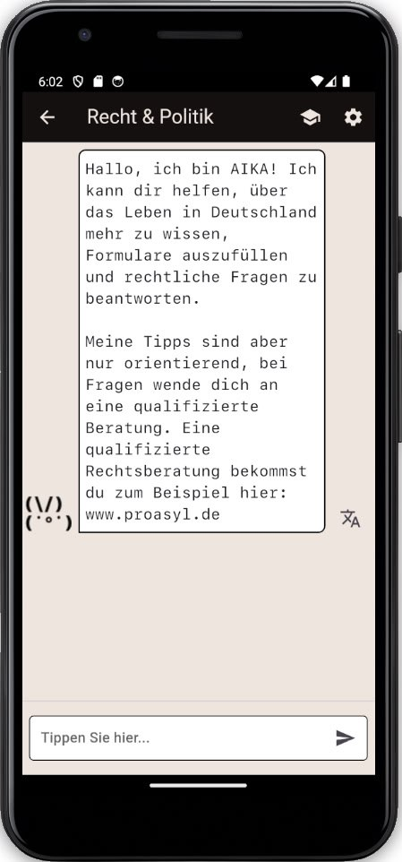

# Key Components

## Authentication Screen (`authentification_screen.dart`)
- **Purpose**: Handles user authentication (login/register).

## Main Menu Screen (`main_menu_screen.dart`)
- **Purpose**: Central hub for navigating to different parts of the app.

## German Chat Screen (`german_chat_screen.dart`)
- **Purpose**: Facilitates chats to learn German and complete German learning lessons.

## Law Chat Screen (`law_chat_screen.dart`)
- **Purpose**: Facilitates chats related to legal advice or queries.

