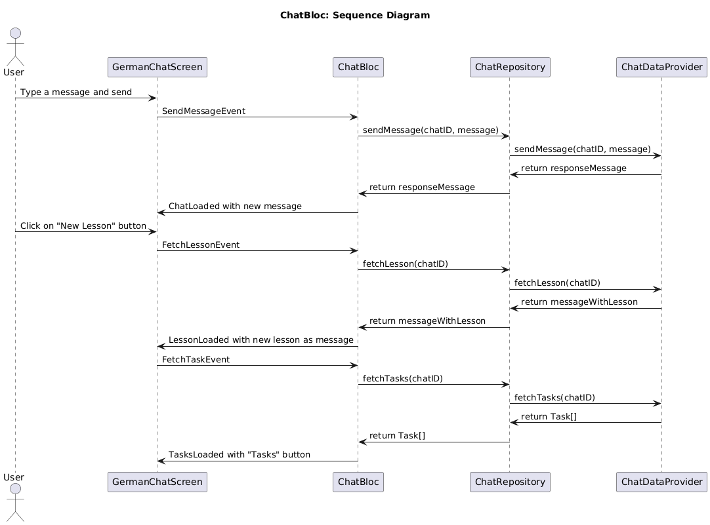
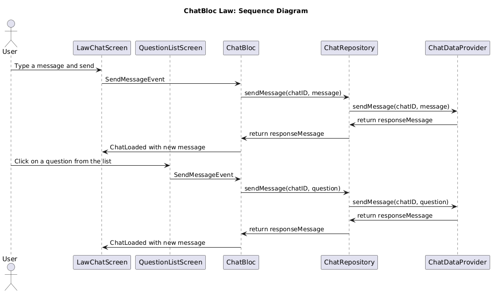

# ChatBloc

## Overview
The `ChatBloc` is responsible for managing the state and business logic of chat interactions within the application. It handles events related to sending messages, sending images, fetching lessons, fetching tasks, and initializing chat sessions.

## Sequence Diagram
**German Chat**

**Law & Politcs Chat**

## Dependencies
- **SendMessage**: Use case for sending text messages.
- **SendImage**: Use case for sending image messages.
- **FetchLesson**: Use case for fetching a lesson within the chat.
- **FetchTasks**: Use case for fetching tasks related to the lesson.

## States

### ChatInitial
- **Description**: The initial state of the chat when no actions have been taken.

### ChatLoading
- **Description**: State when chat-related data (messages, lessons, tasks) is being fetched or processed.

### ChatLoaded
- **Description**: State when chat messages have been successfully loaded and displayed.

### TaskLoaded
- **Description**: State when tasks associated with the chat have been successfully loaded.

### LessonLoaded
- **Description**: State when a lesson within the chat has been successfully loaded.

### ChatError
- **Description**: State representing an error that occurred during chat operations.

## Events

### InitializeChatEvent
- **Description**: Triggers the initialization of a chat session, fetching the message history.
- **Properties**:
  - `chatID`: The identifier of the chat to initialize.

### SendMessageEvent
- **Description**: Triggers the sending of a text message.
- **Properties**:
  - `chatID`: The identifier of the chat.
  - `content`: The content of the message.

### SendImageEvent
- **Description**: Triggers the sending of an image message.
- **Properties**:
  - `chatID`: The identifier of the chat.
  - `path`: The path to the image file.

### FetchLessonEvent
- **Description**: Triggers the fetching of a lesson within the chat.
- **Properties**:
  - `chatID`: The identifier of the chat.

### ProposeLessonEvent
- **Description**: Used to propose a new lesson if the previous lesson is completed.
- **Properties**:
  - `previousLessonCompleted`: A boolean indicating if the previous lesson was completed.
  - `chatID`: The identifier of the chat.

### ClearChatEvent
- **Description**: Triggers clearing of the chat history.
- **Properties**:
  - `chatID`: The identifier of the chat to clear.

### FetchTaskEvent
- **Description**: Triggers fetching tasks associated with the chat.
- **Properties**:
  - `chatID`: The identifier of the chat.
